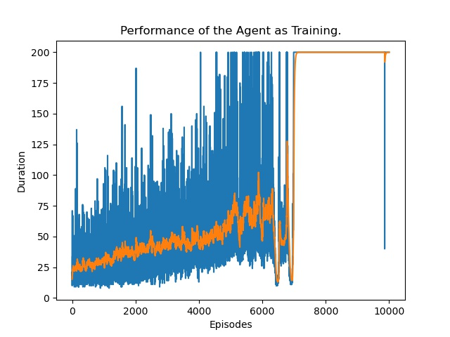
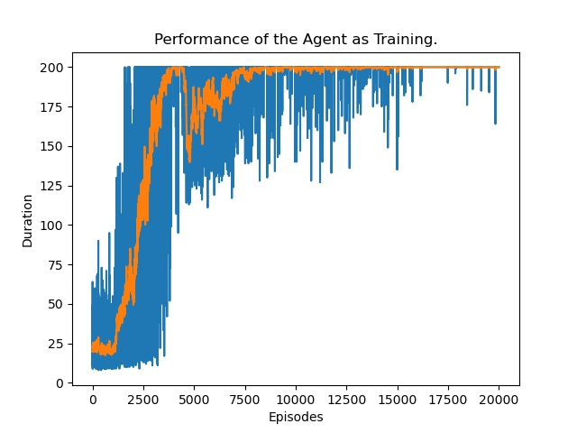

## CMSC742 Course Project
### Adversarial Communication in Multi-Agent Reinforcement Learning System
###### Chenghao Deng, Haowei Deng, Dehao Yuan

The goal of the project is to improve the robustness of deep Q-learning by adding a simple regularization term. The regularization term serves as a random smoother and has been proved effective in classification tasks. In this project, we adapt the regularization term to reinforcement learning tasks and shows the effectiveness by experimenting in a simple environment setting. The detail of the algorithm can be viewed in our [final report](https://www.google.com).

We use CartPole as the environment setting and show the randomized smoothing does not affect the performance of the agent, while improve the robustness against attack.

0. Install the required packages:

`pip install -r requirements.txt`

1. Test the performance of a dummy agent, which randomly selects actions.

`python test_random.py`

2. Train an agent without regularization:

`python train_DQN.py -config configs/normal.json`

3. Train an agent with regularization:

`python train_DQN.py -config configs/robust.json`

4. Attack the normal agent:

`python train_attacker.py -attack_config configs/attack.json -agent_config configs/normal.json -norm_bound 5` 

5. Attack the robust agent:

`python train_attacker.py -attack_config configs/attack.json -agent_config configs/robust.json -norm_bound 5`

The training curve of the normal agent:

The training curve of the robust agent:

